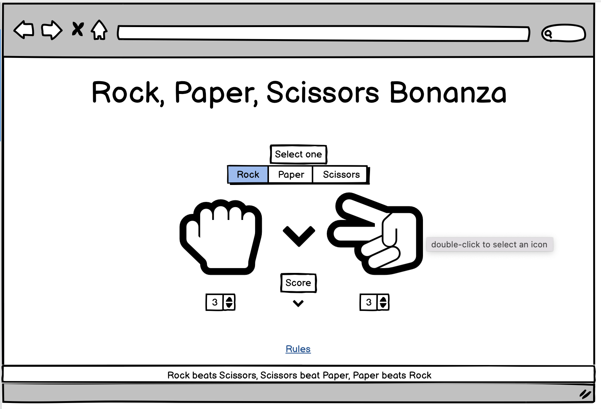
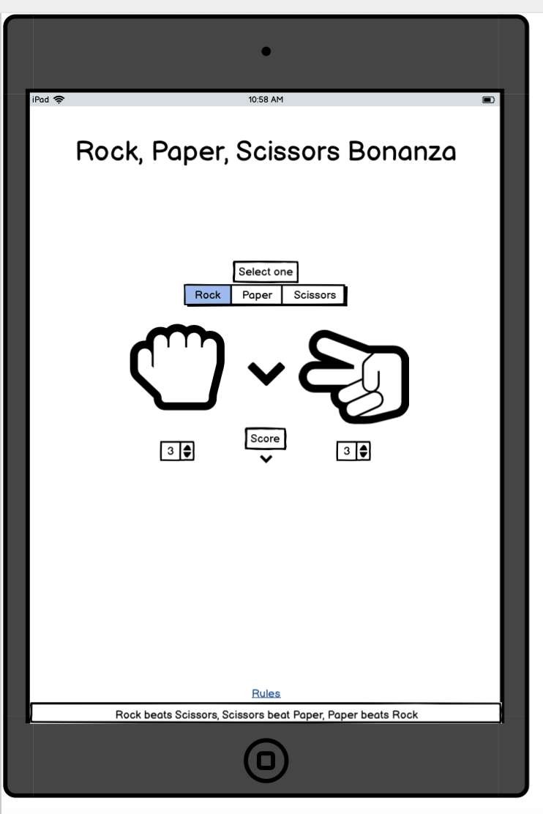
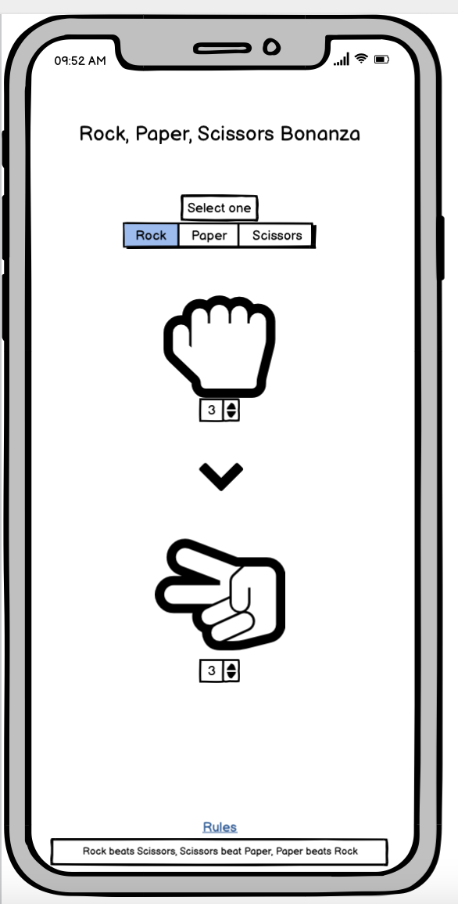

# Rock, Paper Scissors Bonanza

Rock, paper, scissors bonanza is a website that contains a simple game of rock, paper scissors where the user will be able to select one of the following answers and the computer will randomly generate a response to the users choice and will either beat the user or lose to the user. There will be a tally counter to display the scores and rules will be set out on the footer of the page.

## UX

The site is fresh and easy to navigate with simple but to the point information. Mostly users will be able to play a simple game of rock, paper, scissors against the computer and will have a score tally to show who is winning. Icons will be big and easy to use to make it simple for the user to play the game.

## User Stories
- As a new user of this website, I want to easily be able to see the purpose of the site and how to navigate it.
- As a new user of this website, I want to be able to easily see how to play the game.
- As a new user of this website, I want to playability of the game to be simple a smooth.
- As a new user of this website, I want to be able to see who is winning between myself and the CPU.
- As a new user of this website, I want to be able to see the rules of the game.

# Wireframes

Desktop

  

Ipad

  

Iphone

  

