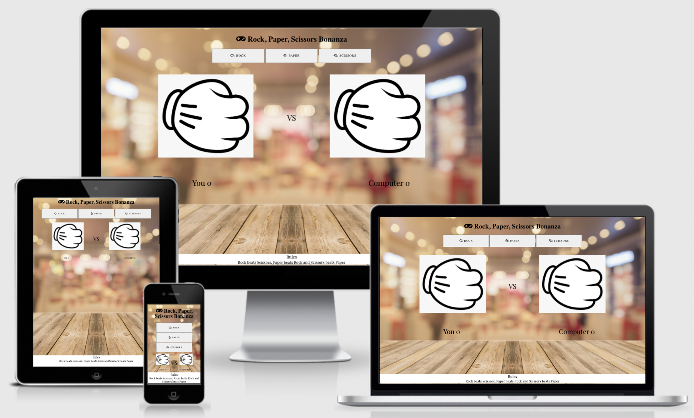
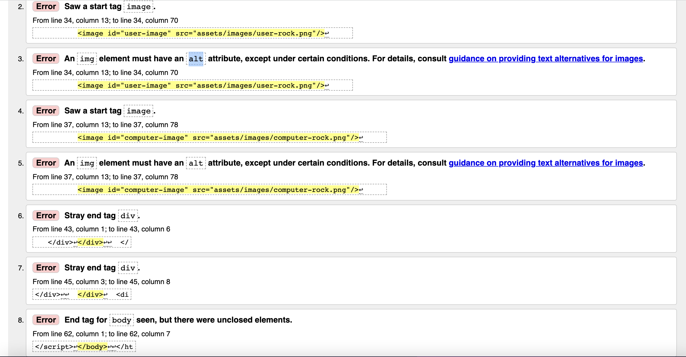
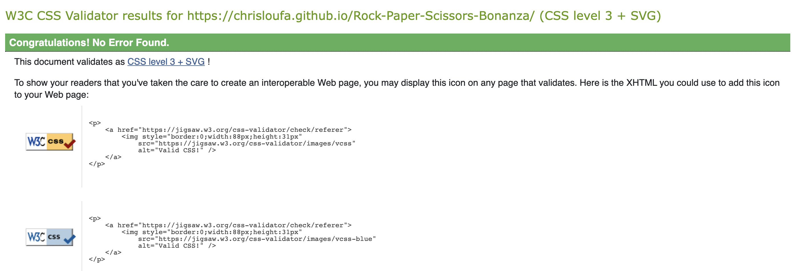
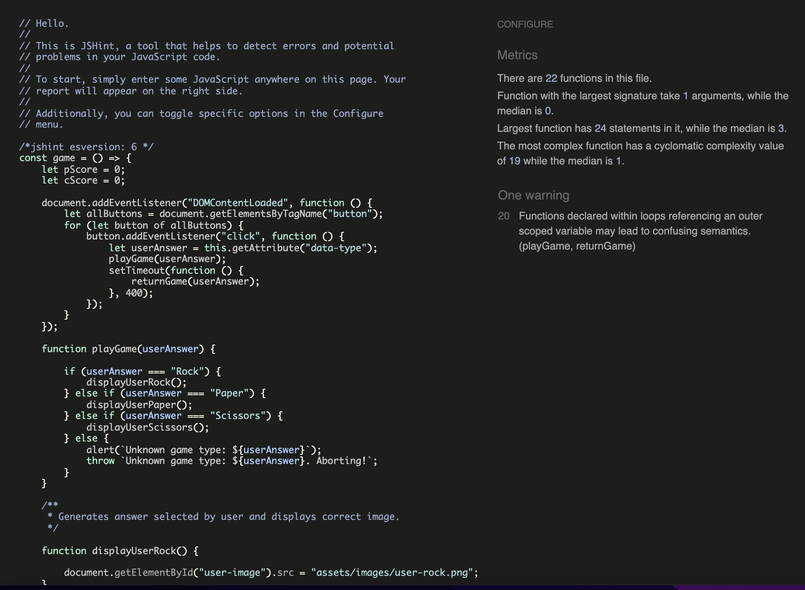
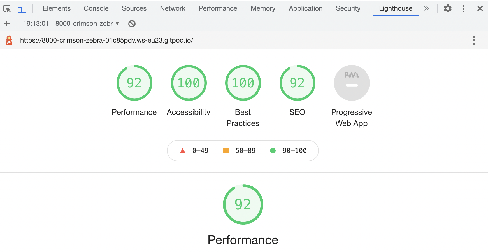
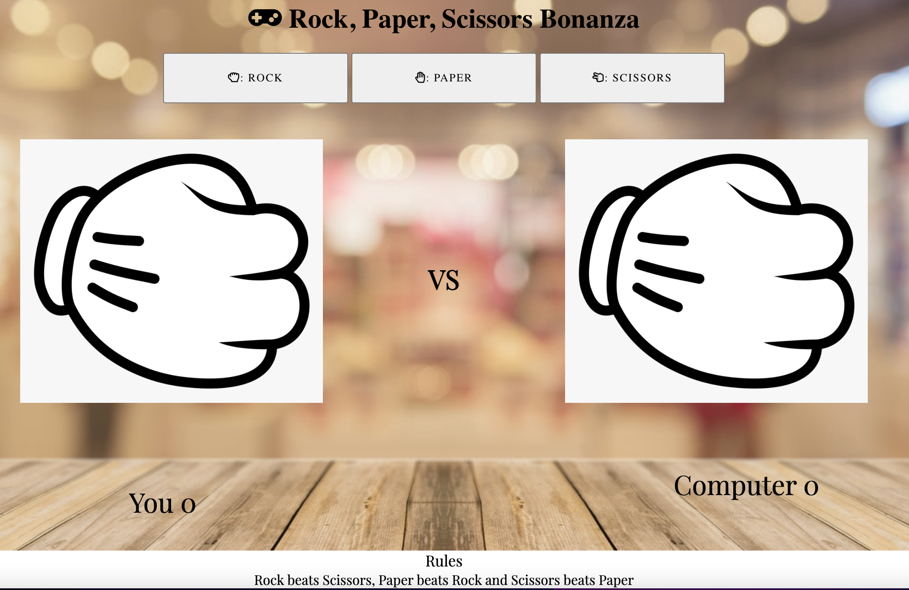
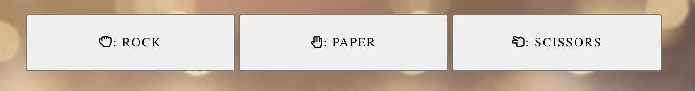
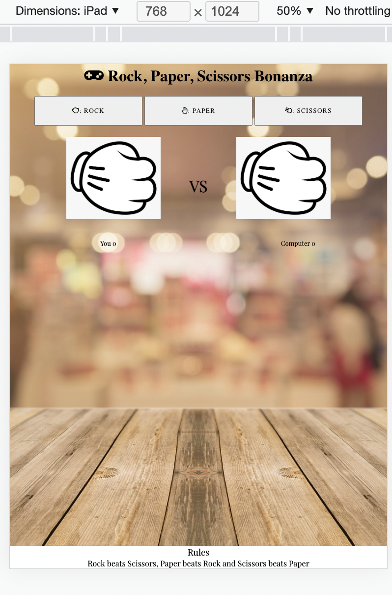
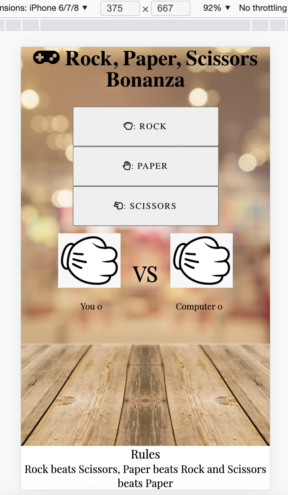

# Rock, Paper Scissors Bonanza

Rock, paper, scissors bonanza is a website that contains a simple game of rock, paper scissors where the user will be able to select one of the following answers and the computer will randomly generate a response to the users choice and will either beat the user or lose to the user. There will be a tally counter to display the scores and rules will be set out on the footer of the page.

## UX

The site is fresh and easy to navigate with simple but to the point information. Mostly users will be able to play a simple game of rock, paper, scissors against the computer and will have a score tally to show who is winning. Icons will be big and easy to use to make it simple for the user to play the game.

## User Stories
1. As a new user of this website, I want to easily be able to see the purpose of the site and how to navigate it.
2. As a new user of this website, I want to be able to easily see how to play the game.
3. As a new user of this website, I want to playability of the game to be simple a smooth.
4. As a new user of this website, I want to be able to see who is winning between myself and the CPU.
5. As a new user of this website, I want to be able to see the rules of the game.

# Features

## Existing features

- **Play choice**

Able to pick your choice of play (rock, paper or scissors) to play against the opponent. This is bold and easy to choose.

- **Interactive Hover images**

Images that enlarge upon hovering over them to highlight the choice of play that you have made and also including the opponents choice of play.

- **Score tally**

Score tally to keep both yours and your opponents score.

- **Footer**

Footer that explains the rules of the game.

## Future Features

Potential to play against other users online across the planet.

# Wireframes

Desktop

  

Ipad

  

Iphone

  

# Typography and colour scheme

## Design

The website is clear and fresh and gives the user an obvious focus on what the site has to offer. The game buttons are larger and easy to see with interactive features to allow the user to see its function.

## Chosen Colors

#000000 - for all the text content.

#ffffff - for all background content to allow for good contrast.

## Media

**Background image -** - gives the illusion of playing the rock, paper, scissors game at a table.

**Game images -** - interchangeable game images so users can see what the player and opponent have chosen.

# Technology

## **Languages**

[HTML5 - Wikipedia](https://en.wikipedia.org/wiki/HTML5)

[CSS - Wikipedia](https://en.wikipedia.org/wiki/CSS)

[Javascript - Wikipedia](https://en.wikipedia.org/wiki/JavaScript)

## Framework

[Google Fonts](https://fonts.google.com/)

[Font Awesome](https://fontawesome.com/)

[Pexels](https://www.pexels.com/)

[GitHub](https://github.com/)

[Gitpod](https://www.gitpod.io/)

[Balsamiq](https://balsamiq.com/)

# Testing

## Code validation

**HTML**

- 8 error messages returned and fixes applied.

**CSS**

**JS**

**Lighthouse tools testing**

# User story testing

1. As a new user of this website, I want to easily be able to see the purpose of the site and how to navigate it.

2. As a new user of this website, I want to be able to easily see how to play the game.

3. As a new user of this website, I want to playability of the game to be simple a smooth.

4. As a new user of this website, I want to be able to see who is winning between myself and the CPU.

5. As a new user of this website, I want to be able to see the rules of the game.

# Final Product

## Desktop

## Ipad

## Iphone

# Supported screens and browsers

Site has been tested on Chrome, Safari and Firefox desktop version browsers.
Chrome developers tools was used to test responsiveness on Desktop, Laptop, Moto G4, Galaxy S5, Pixel 2, Pixel 2 XL, iPhone 5/SE, iPhone 6/7/8, iPhone 6/7/8 Plus, iPhone X, iPad, iPad Pro, Surface Duo.

# Deployment

## GitHub Pages
1. Log into GitHub and locate the repository.
2. On the nav bar look for the settings option and click on it.
3. Scroll towards to the bottom of the page.
4. Click the yellow "check it out here" link under GitHub pages.
4. Under 'Source' dropdown, click 'Main' from the options.
5. Click the save button.
6. The sitre will then be published. 
7. The site URL is visible on the green bar under the "Github Pages".

## Gitpod

1. You will need to search for and download the Gitpod browser extension.
2. Then proceed to login to GitHub.
3. Find the repository you wish to view.
3. Click the green "Gitpod" button.
4. Now you will be taken to a new tab and will be able to view the Gitpod repository.

# Credits

## Content

- Credit to DevEdwin for his youtube tutorials and sharing code on github which helped to to figure out how to add my score counter.